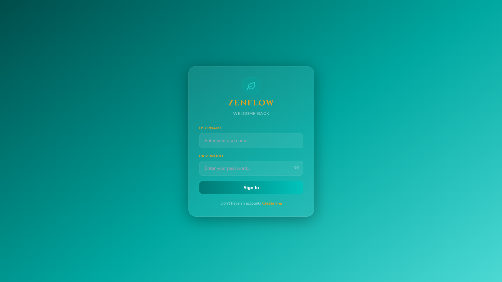
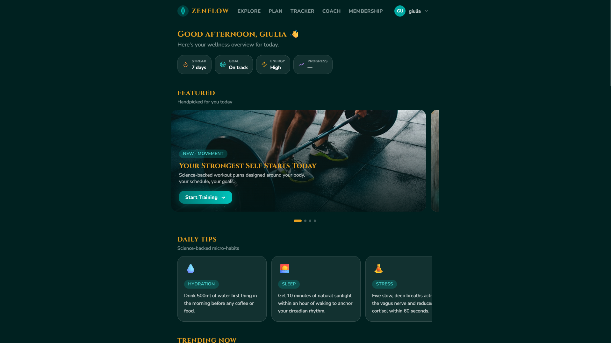
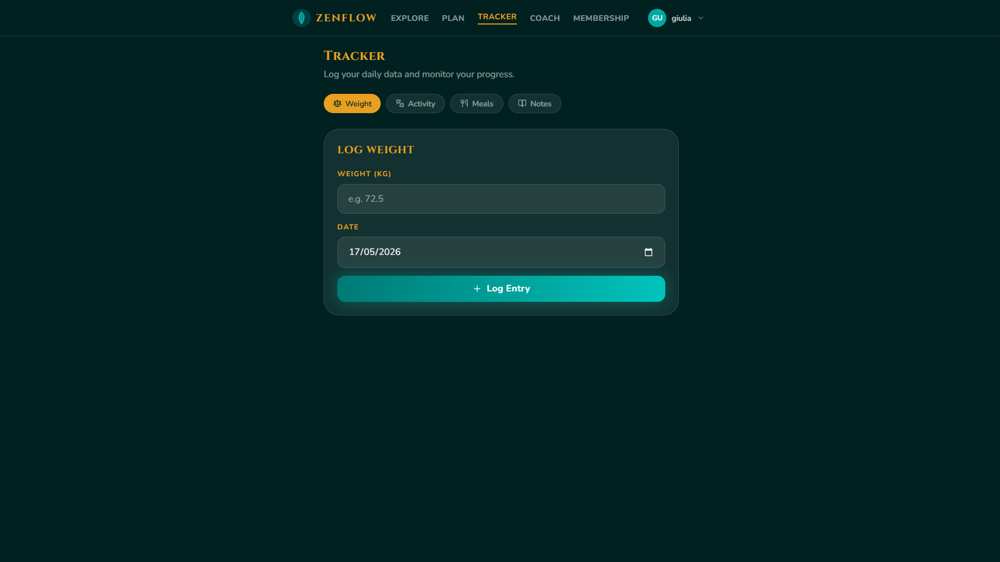
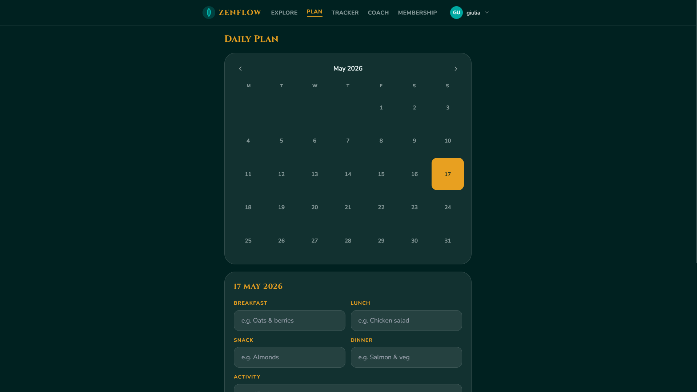
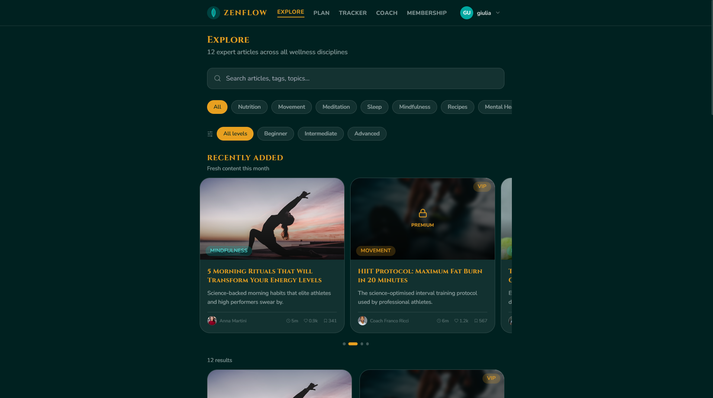
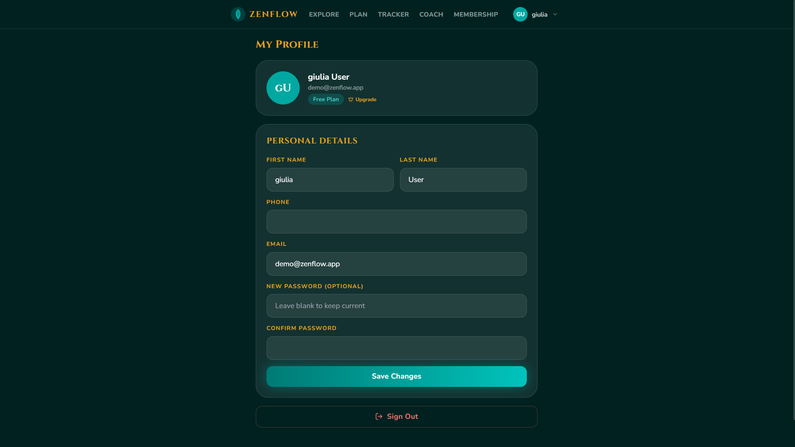
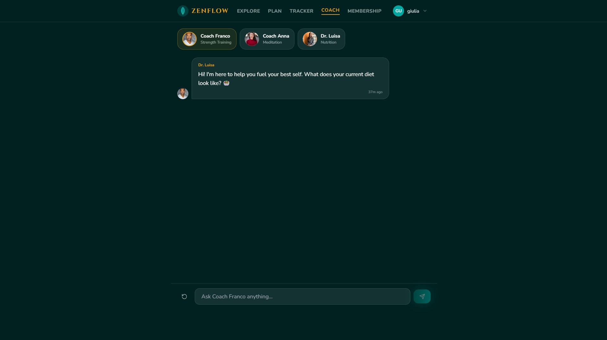
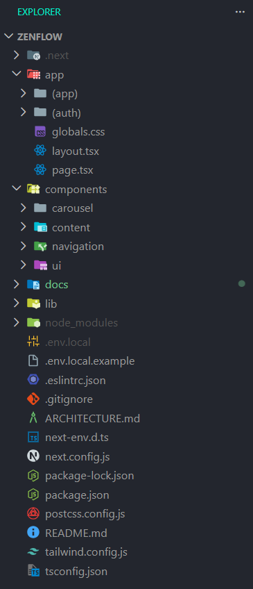

# ZenFlow Platform 🧘‍♂️ — Enterprise Wellness & Lifestyle Platform

> Enterprise-grade mobile-first web application for managing fitness, nutrition, mental well-being, and healthy lifestyle routines through modular frontend engineering and user-centered interaction design.


---

# 🇬🇧 English Documentation

ZenFlow (conceptually developed as **Wellness Tips**) is a modular, performance-oriented, and enterprise-inspired frontend web application designed to simplify and improve the management of a healthy lifestyle.

The platform provides an integrated ecosystem for:

- physical activity tracking
- dietary planning
- wellness monitoring
- motivational support
- AI-assisted interaction
- routine organization

The application demonstrates the evolution of an academic interaction design project into a production-style frontend architecture focused on:

- modular component isolation
- scalable UI rendering
- client-side state persistence
- mobile-first responsive design
- intuitive UX engineering
- interactive wellness systems

Developed as part of the **Progettazione dell'Interazione con l'Utente** curriculum at **Università degli Studi di Bari Aldo Moro** (A.Y. 2024/2025).

---

# 🚀 Core Engineering Highlights

## 📦 Modular Next.js Architecture

The application adopts a modular App Router architecture using Next.js 14, enabling clear separation between authentication flows, application pages, reusable UI components, and global rendering logic.

Core architectural modules include:

- authentication routes
- dashboard systems
- planner interfaces
- tracking modules
- AI coaching components
- reusable UI elements

The architecture improves:

- maintainability
- scalability
- component reusability
- rendering performance
- frontend organization

---

## ⚡ Client-side State Persistence & Data Management

ZenFlow implements lightweight and scalable client-side state management using Zustand with persistent local storage support.

The state layer handles:

- user session persistence
- wellness tracking data
- planner synchronization
- dashboard updates
- dynamic UI state rendering

Validation pipelines are implemented using **Zod** to ensure runtime data consistency and safer form management.

Example validation pattern:

```typescript
import { z } from "zod";

export const loginSchema = z.object({
  username: z.string().min(3),
  password: z.string().min(6),
});
```

---

## 🤖 Interactive AI Wellness Coach

The platform integrates an AI-inspired wellness coaching interface designed to simulate personalized interaction and motivational guidance.

Core features include:

- conversational interaction system
- motivational suggestions
- personalized wellness feedback
- emotional support simulation
- asynchronous response rendering

The AI module was conceptually designed to reduce user demotivation and improve long-term engagement throughout the wellness journey.

---

## 📊 Holistic Dashboard & Tracking Ecosystem

ZenFlow provides a centralized dashboard for managing and visualizing wellness-related activities through mobile-first interaction systems.

Implemented tracking modules include:

- physical activity monitoring
- meal planning
- calorie tracking
- hydration tracking
- progress visualization
- daily note systems

Interactive carousels and responsive cards improve usability and information hierarchy across all screen sizes.

---

## 🎨 Mobile-First Glassmorphism UI System

The frontend interface implements a modern glassmorphism-inspired design language optimized for touch interaction and accessibility.

Core UI engineering features include:

- Tailwind CSS utility-first styling
- responsive mobile-first layouts
- blurred glassmorphism containers
- animated transitions
- reusable design tokens
- optimized spacing systems
- intuitive navigation flows

The interface prioritizes:

- readability
- visual hierarchy
- reduced cognitive load
- long-term usability

---

## ⚙️ Scalable Frontend Runtime

The platform leverages Next.js 14 App Router capabilities combined with modern React rendering pipelines.

Implemented technologies include:

- React Server Components
- dynamic client-side rendering
- route grouping systems
- reusable component architecture
- optimized hydration strategies
- asynchronous interaction pipelines

This approach provides:

- improved scalability
- better rendering efficiency
- cleaner code organization
- maintainable frontend growth

---

# 📁 System Architecture Tree

```text
zenflow-platform/
├── app/                          # Next.js 14 App Router
│   ├── (auth)/                   # Authentication routes
│   ├── (app)/                    # Main application routes
│   ├── globals.css               # Global styling system
│   ├── layout.tsx                # Root application layout
│   └── page.tsx                  # Landing page
├── components/                   # Reusable UI Components
│   ├── ui/                       # Atomic UI elements
│   ├── navigation/               # Navigation systems
│   ├── content/                  # Cards & content rendering
│   └── carousel/                 # Interactive carousel modules
├── docs/                         # Documentation & Academic Material
│   ├── academic/                 # Original academic archive
│   └── assets/                   # Screenshots & media assets
├── lib/                          # Core application logic
│   ├── store/                    # Zustand state persistence
│   ├── types/                    # TypeScript interfaces
│   ├── utils/                    # Helper utilities
│   └── schemas.ts                # Zod validation schemas
├── public/                       # Static assets
├── .env.local.example            # Environment template
├── next.config.js                # Next.js configuration
├── tailwind.config.ts            # Tailwind configuration
└── package.json                  # Project dependencies
```

---

# 📸 Application Previews

<details>
<summary><b>Click to expand screenshots</b></summary>

|                        Login Interface                         |                          Main Dashboard                           |
| :------------------------------------------------------------: | :---------------------------------------------------------------: |
|  |  |

|                       Wellness Tracker                        |                       Planning System                       |
| :-----------------------------------------------------------: | :---------------------------------------------------------: |
|  |  |

|                       Explore Interface                       |                         User Profile                          |
| :-----------------------------------------------------------: | :-----------------------------------------------------------: |
|  |  |

|                      AI Wellness Coach                       |                       File System Architecture                        |
| :----------------------------------------------------------: | :-------------------------------------------------------------------: |
|  |  |

</details>

---

# ⚙️ System Setup & Execution

## 1. Clone the Repository

```bash
git clone https://github.com/magronemichele/zenflow-platform.git
cd zenflow-platform
```

---

## 2. Configure the Environment

Copy the environment template:

```bash
copy .env.local.example .env.local
```

No additional configuration is required for the demo environment.

---

## 3. Install Dependencies

```bash
npm install
```

---

## 4. Launch the Development Server

```bash
npm run dev
```

---

## 5. Access the Application

```text
http://localhost:3000
```

---

## 6. Demo Authentication

You can authenticate using:

- any username with at least 3 characters
- any password with at least 6 characters

---

# 🛡 Architecture & Performance Features

- App Router architecture
- React Server Components
- Zustand persistent state management
- TypeScript strict mode
- Zod runtime validation
- mobile-first rendering strategy
- reusable component systems
- optimized frontend hydration
- responsive glassmorphism UI
- scalable frontend organization

---

# 📚 Technology Stack

| Layer            | Technology                     |
| ---------------- | ------------------------------ |
| Architecture     | Component-based App Router     |
| Framework        | Next.js 14                     |
| Language         | TypeScript 5                   |
| State Management | Zustand 4                      |
| Validation Layer | Zod                            |
| Styling & UI     | Tailwind CSS 3                 |
| Form Handling    | React Hook Form 7              |
| Rendering Model  | Server & Client-side Rendering |

---

# 📄 License & Academic Context

This project is provided exclusively for educational, UI/UX interaction analysis, and frontend engineering reference purposes.

The platform originally served as the final academic assignment for the **Progettazione dell'Interazione con l'Utente** course at the **Università degli Studi di Bari Aldo Moro**.

Before adapting the project for production-oriented deployments, ensure:

- backend database integration
- secure authentication systems
- production-grade API endpoints
- AI backend integration
- accessibility auditing
- deployment optimization

The original academic documentation archive (including Personas, Task Analysis, UEQ/SUS Questionnaires, and UX Research) is preserved within:

```text
docs/academic/
```

The authors assume no liability for improper deployment, insecure modifications, or misuse in unmanaged environments.

---

# 👥 Authors & Academic Credentials

- **Giovanni Rutigliano** — Student ID: _781806_
  `g.rutigliano33@studenti.uniba.it`

- **Michele Magrone** — Student ID: _778705_
  `m.magrone11@studenti.uniba.it`

---

**Università degli Studi di Bari Aldo Moro**
_Department of Computer Science (ITPS) — Academic Year 2024/2025_
